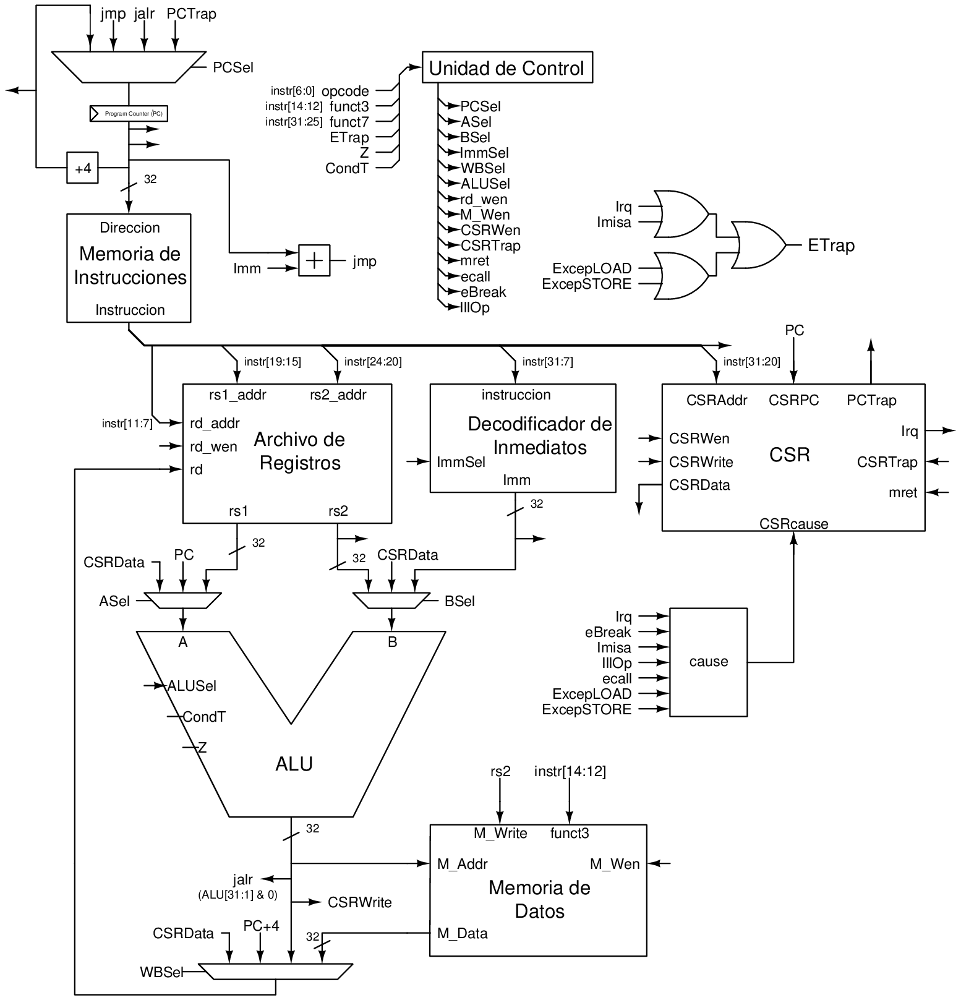

<!-- Improved compatibility of back to top link: See: https://github.com/othneildrew/Best-README-Template/pull/73 -->

<!-- TABLE OF CONTENTS -->

  
Table of contents

  <ol>
    <li><a href="#about-the-project">About this project</a></li>
    <li><a href="#instruction-set">Instruction Set</a></li>
    <li><a href="#csr-registers">CSR Registers</a></li>
    <li><a href="#machine-mode">Machine Mode</a></li>
    <li><a href="#interrupts-and-exceptions">Interrupts and Exceptions</a></li>
    <li><a href="#schematics">Schematics</a>
     <ul>
        <li><a href="#fpga-synthetizable">FPGA synthetizable</a></li>
        <li><a href="#simulation">Simulation</a></li>
     </ul>
    </li>
  </ol>

<!-- ABOUT THE PROJECT -->
## About this project

This repository contains the vhdl description of a RISC-V processor based on the RV32I ISA (The RISC-V Instruction Set Manual Volume I: Unprivileged ISA 20191214-draft), which operates only in machine mode (The RISC-V Instruction Set Manual Volume II: Privileged Architecture 1.12-draft). The project is divided into two sections: <a href="./Simulation">simulation</a>(a microarchitecture with a five-stage pipeline and a two-bit branch predictor) and <a href="./Synthetizable"> FPGA synthetisable </a> (a microarchitecture without a pipeline that executes instructions in a single clock cycle that can be implemented in an FPGA). 

(<a href="#readme-top">back to top</a>)

<!-- GETTING STARTED -->
## Instruction Set

<table>
    <tr>
        <td>auipc</td>
        <td>jal</td>
        <td>jalr</td>
        <td>beq</td>
        <td>bne</td>
    </tr>
    <tr>
        <td>blt</td>
        <td>bge</td>
        <td>bltu</td>
        <td>bgeu</td>
        <td>lb</td>
    </tr>
    <tr>
        <td>lh</td>
        <td>lw</td>
        <td>lbu</td>
        <td>lhu</td>
        <td>sb</td>
    </tr>
    <tr>
        <td>sh</td>
        <td>sw</td>
        <td>addi</td>
        <td>slti</td>
        <td>sltiu</td>
    </tr>
    <tr>
        <td>xori</td>
        <td>ori</td>
        <td>andi</td>
        <td>slli</td>
        <td>srli</td>
    </tr>
    <tr>
        <td>srai</td>
        <td>add</td>
        <td>sub</td>
        <td>sll</td>
        <td>slt</td>
    </tr>
    <tr>
        <td>sltu</td>
        <td>xor</td>
        <td>srl</td>
        <td>sra</td>
        <td>or</td>
    </tr>
    <tr>
        <td>and</td>
        <td>fence</td>
        <td>ecall</td>
        <td>ebreak</td>
        <td>mret</td>
    </tr>
    <tr>
        <td>sret</td>
        <td>uret</td>
        <td>csrrw</td>
        <td>csrrs</td>
        <td>csrrc</td>
    </tr>
    <tr>
        <td>csrrwi</td>
        <td>csrrsi</td>
        <td>csrrci</td>
        <td>lui</td>
    </tr>               
</table> 

* By operating only in machine mode, the instructions uret and sret raise an illegal instruction exception.

(<a href="#readme-top">back to top</a>)

## CSR Registers

<table>
    <tr>
        <th>Register</th>
        <th>Observations</th>
    </tr>
    <tr>
        <td>mcause</td>
        <td>Read and Write</td>
    </tr>
    <tr>
        <td>mtvec</td>
        <td>Read and Write</td>
    </tr>
    <tr>
        <td>mscratch</td>
        <td>Read and Write</td>
    </tr>
    <tr>
        <td>mepc</td>
        <td>Read and Write of bits 31 to 2; the last two bits are constant cero.</td>
    </tr>
    <tr>
        <td>misa</td>
        <td>Read Only</td>
    </tr>
    <tr>
        <td>mstatus</td>
        <td>Only bits MPIE and MIE can be written; MPP bits are constants with the value "11," and the rest of the bits are constants with the value "0."</td>
    </tr>
    <tr>
        <td>mie</td>
        <td>Only bit 11 can be read and written (Machine External Interrupt).</td>
    </tr>
    <tr>
        <td>mip</td>
        <td>Read only; irq will be displayed on 11-bit (Machine External Interrupt).</td>
    </tr>
</table> 

(<a href="#readme-top">back to top</a>)

## Machine Mode
In machine mode, the programs have access to all instructions and CSR registers. Furthermore, this implementation does not have memory virtualization, so every memory access is a physical address , consequently programs have total access to the memory layout.

(<a href="#readme-top">back to top</a>)

## Interrupts and Exceptions

The processor has a pin called IRQ that is used to generate interrupts and is activated by a logical high that has to be maintained high during its handle.

Based on the description of the processor, these are the interrupts or exceptions that can be raised.

* Environment break
* Instruction address misalignment
* Illegal instruction
* Environment call
* Store address misalignment
* Load address misalignment
* Machine external interrupt

(<a href="#readme-top">back to top</a>)

## Schematics

### FPGA synthetizable

    

### Simulation

    

Currently, I'm working on adding AXI4 compatible interfaces to the instruction and data memory ports, so I have to add cache memory to them.

(<a href="#readme-top">back to top</a>)
