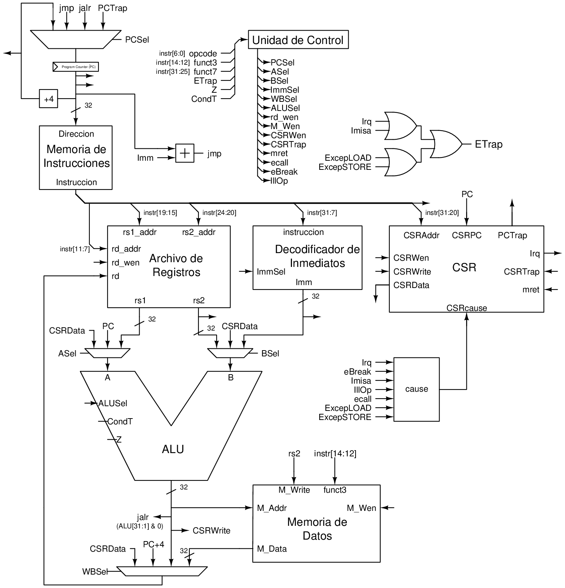

<!-- Improved compatibility of back to top link: See: https://github.com/othneildrew/Best-README-Template/pull/73 -->

<!-- TABLE OF CONTENTS -->

  
Tabla de contenido

  <ol>
    <li><a href="#acerca-del-proyecto">Acerca del proyecto</a></li>
    <li><a href="#set-de-instrucciones">Set de Instrucciones</a></li>
    <li><a href="#registros-csr">Registros CSR</a></li>
    <li><a href="#machine-mode">Machine Mode</a></li>
    <li><a href="#interrupciones-y-excepciones">Interrupciones y excepciones</a></li>
    <li><a href="#esquematicos">Esquematicos</a>
     <ul>
        <li><a href="#sintetizable">Sintetizable</a></li>
        <li><a href="#simulacion">Simulacion</a></li>
     </ul>
    </li>
  </ol>

<!-- ABOUT THE PROJECT -->
## Acerca del proyecto

Este repositorio contiene la descripción en vhdl de un procesador RISC-V del ISA base rv32i (The RISC-V Instruction Set Manual Volume I: Unprivileged ISA 20191214-draft), el cual opera únicamente en machine mode (The RISC-V Instruction Set Manual Volume II: Privileged Architecture 1.12-draft). El proyecto se separa en dos partes, <a href="./Simulation">simulación</a>, una microarquitectura con cinco etapas de pipeline y un predictor dinámico de saltos de dos bits y <a href="./Synthetizable">sintesis en FPGA</a>, una microarquitectura el cual no posee pipeline y ejecuta instrucciones en un solo ciclo de reloj, pero es sintetizable en una FPGA.

(<a href="#readme-top">back to top</a>)

<!-- GETTING STARTED -->
## Set de Instrucciones

<table>
    <tr>
        <td>auipc</td>
        <td>jal</td>
        <td>jalr</td>
        <td>beq</td>
        <td>bne</td>
    </tr>
    <tr>
        <td>blt</td>
        <td>bge</td>
        <td>bltu</td>
        <td>bgeu</td>
        <td>lb</td>
    </tr>
    <tr>
        <td>lh</td>
        <td>lw</td>
        <td>lbu</td>
        <td>lhu</td>
        <td>sb</td>
    </tr>
    <tr>
        <td>sh</td>
        <td>sw</td>
        <td>addi</td>
        <td>slti</td>
        <td>sltiu</td>
    </tr>
    <tr>
        <td>xori</td>
        <td>ori</td>
        <td>andi</td>
        <td>slli</td>
        <td>srli</td>
    </tr>
    <tr>
        <td>srai</td>
        <td>add</td>
        <td>sub</td>
        <td>sll</td>
        <td>slt</td>
    </tr>
    <tr>
        <td>sltu</td>
        <td>xor</td>
        <td>srl</td>
        <td>sra</td>
        <td>or</td>
    </tr>
    <tr>
        <td>and</td>
        <td>fence</td>
        <td>ecall</td>
        <td>ebreak</td>
        <td>mret</td>
    </tr>
    <tr>
        <td>sret</td>
        <td>uret</td>
        <td>csrrw</td>
        <td>csrrs</td>
        <td>csrrc</td>
    </tr>
    <tr>
        <td>csrrwi</td>
        <td>csrrsi</td>
        <td>csrrci</td>
        <td>lui</td>
    </tr>               
</table> 

* Al únicamente operar en machine mode las instrucciones uret y sret causan una excepción de instrucción ilegal

(<a href="#readme-top">back to top</a>)

## Registros CSR

<table>
    <tr>
        <th>Registro</th>
        <th>Observaciones</th>
    </tr>
    <tr>
        <td>mcause</td>
        <td>Lectura y Escritura</td>
    </tr>
    <tr>
        <td>mtvec</td>
        <td>Lectura y Escritura</td>
    </tr>
    <tr>
        <td>mscratch</td>
        <td>Lectura y Escritura</td>
    </tr>
    <tr>
        <td>mepc</td>
        <td>Lectura y Escritura de bits 31 al 2, ultimos dos bit son ceros constantes</td>
    </tr>
    <tr>
        <td>misa</td>
        <td>Lectura</td>
    </tr>
    <tr>
        <td>mstatus</td>
        <td>Lectura y Escritura únicamente de los bits MPIE y MIE, bits MPP constante valor de ‘11’ el resto de bits son constantes cero</td>
    </tr>
    <tr>
        <td>mie</td>
        <td>Lectura y Escritura únicamente del bit 11 (machine external interrupt)</td>
    </tr>
    <tr>
        <td>mip</td>
        <td>Lectura únicamente el valor de irq será desplegado en el bit 11 (machine external interrupt)</td>
    </tr>
</table> 

(<a href="#readme-top">back to top</a>)

## Machine Mode
Al operar en machine mode los programas tienen acceso a todas las instrucciones, registros CSR disponibles, adicionalmente al no poseer virtualización cada acceso corresponde a una dirección física, por lo que los programas tienen acceso a todo el mapeo de memoria.

(<a href="#readme-top">back to top</a>)

## Interrupciones y excepciones

El procesador cuenta con un pin IRQ utilizado para generar interrupciones, el cual es activado con un alto lógico el cual debe ser mantenido durante su manejo.

Basado en la descripción del procesador estas son las excepciones e interrupciones que pueden ser generadas.

* Environment break
* Instruction address misalignment
* Illegal instruction
* Environment call
* Store address misalignment
* Load address misalignment
* Machine external interrupt

(<a href="#readme-top">back to top</a>)

## Esquematicos

### Sintetizable

    

### Simulacion

    

Próximamente, se encuentra en desarrollo el agregar las interfaces de memoria a el protocolo AXI4 en consecuencia seran agregados memorias caché

(<a href="#readme-top">back to top</a>)
