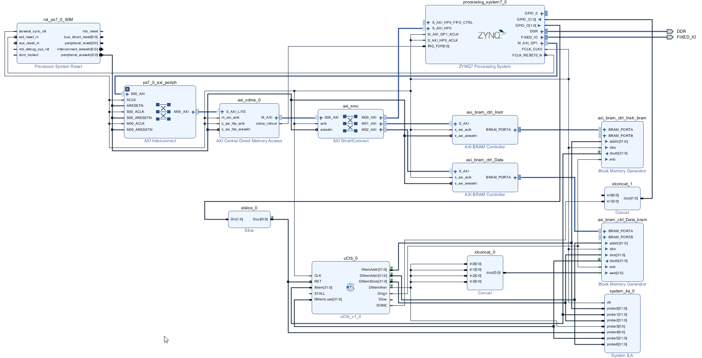

## FPGA synthetizable

At the moment, the processor comes with one configuration, where it is possible to specify the restart address and only the ports for the data and instruction memory. IRQ, RST, STALL, and CLK pins are exposed.

In this configuration, it is assumed that the access to the memories does not have a delay, that is, that the data obtained from the memory happens in the same clock cycle in which the instruction is executed.

## Example project

In Vivado 2018.3, a Zynq-7000 card (xc7z010clg400-1) was used, where two memory blocks are instantiated, one for data and the other for instructions controlled by rv32i. To populate the memory with instructions and data, a DMA is used, which transfers the data to the corresponding memories. On the PS side, you can choose which data to transfer; it also controls the reset of the processor and has an output that goes high when rv32i ends the execution of a program. This is when PC has the program termination value; when compiling for rv32i, at the end of execution, the program must jump to the completion address, which is the address of an infinite loop.

<div align="center">
    
</div>

In the PS part, the DMA is configured, and the bytes corresponding to the ".text" (executable) and ".data" (data used by the program) sections of the program to be executed are transferred. Subsequently, the reset signal is lowered and raised to start the program, and it waits until it ends. At this point, PS will transfer from the rv32i data memory to the PS ram, where the standard output of the program executed in rv32i is interpreted and displayed.

The programs that will be executed in rv32i must be included in PS. To do this, a directive is used in assembler where labels are generated in order to know the size and address of the .text and .data sections to be transmitted.

<div align="center">
    
</div>

<div align="center">
    
</div>

## Compile with rv32i as a target

To compile the program that will be executed in rv32i, the flags -march=rv32i -mabi=ilp32 must be used to specify the target instruction set.

   ```powershell
   riscv64-unknown-elf-gcc -march=rv32i -mabi=ilp32 -Os -O3 -Bstatic -T .\lscript.ld -o .\benchmarks\dhrystone\dhrystone_main.elf .\init.s .\intr.c .\Wnanoprintf.c .\benchmarks\dhrystone\dhrystone.c .\benchmarks\dhrystone\dhrystone_main.c
   ```

The file init.s is used to initialize the processor, intr.c contains exception and interrupt handling in addition to a couple of syscall implementations, and Wnanoprintf is a printf implementation based on <a href="https://github.com/charlesnicholson/nanoprintf">nanoprintf</a>.


### .text section extraction
   ```powershell
    riscv64-unknown-elf-objcopy --dump-section .text=.\benchmarks\dhrystone\dhrystone_main._text .\benchmarks\dhrystone\dhrystone_main.elf
   ```
### .data section extraction
   ```powershell
    riscv64-unknown-elf-objcopy -S -O binary -R .text* -R .comment* -R .riscv* -g --gap-fill 0 .\benchmarks\dhrystone\dhrystone_main.elf .\benchmarks\dhrystone\dhrystone_main._data
   ```