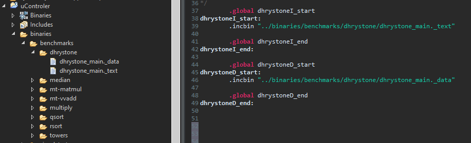

## Sintetizable

De momento solo se posee una configuración, en donde es posible especificar la dirección de reinicio y únicamente tiene expuestos los puertos para la memoria de datos e instrucciones, el pin de IRQ, RST, STALL y CLK.

En esta configuración se asume que el acceso a las memorias no posee retraso, es decir que la obtención de datos de la memoria sucede en el mismo ciclo de reloj en el que se ejecuta la instrucción

## Proyecto Ejemplo

En Vivado 2018.3 se utilizó una tarjeta Zynq-7000 (xc7z010clg400-1), en donde se instancian dos bloques de memoria, uno para datos y otra para instrucciones controlados por rv32i, para poblar la memoria con instrucciones y datos, se utiliza un DMA el cual transfiere los datos a las memorias correspondientes. De lado del PS se puede escoger qué datos transferir, además controla el reset del procesador y posee una salida el cual se pone en alto al momento que rv32i termina la ejecución de un programa. Esto es cuando PC tiene el valor de terminación de programa, es decir al compilar para rv32i, al finalizar la ejecución de un programa se debe de saltar a la dirección de finalización la cual debe ser un loop infinito.

<div align="center">
    
</div>

En la parte de PS, se configura el DMA y se transfieren los bytes correspondientes a la sección .text (ejecutable) y .data (data utilizada por el programa) del programa que desea ejecutarse. Posteriormente se baja y levanta la señal de reset para dar inicio al programa y queda en espera hasta que este finalice. En este punto PS transferirá de la memoria de datos de rv32i a la ram del PS donde se interpreta y despliega el standard output del programa ejecutado en rv32i.

Los programas que serán ejecutados en rv32i deben ser incluidos en PS para ello se utiliza una directriz en asembler donde se generan etiquetas con el objetivo de conocer el tamaño y la direccion de la sección .text y .data a transmitir.

<div align="center">
    
</div>

<div align="center">
    
</div>

## Compilar para rv32i

Para compilar el programa que será ejecutado en rv32i se deben utilizar las banderas  -march=rv32i -mabi=ilp32 para especificar el set de instrucciones objetivo

   ```powershell
   riscv64-unknown-elf-gcc -march=rv32i -mabi=ilp32 -Os -O3 -Bstatic -T .\lscript.ld -o .\benchmarks\dhrystone\dhrystone_main.elf .\init.s .\intr.c .\Wnanoprintf.c .\benchmarks\dhrystone\dhrystone.c .\benchmarks\dhrystone\dhrystone_main.c
   ```

El archivo init.s es utilizado para inicializar el procesador, intr.c contiene el manejo de excepciones e interrupciones adicional a un par de implementaciones de syscalls, Wnanoprintf es un implementacion de printf basado en <a href="https://github.com/charlesnicholson/nanoprintf">nanoprintf</a>.


### Extraer sección .text
   ```powershell
    riscv64-unknown-elf-objcopy --dump-section .text=.\benchmarks\dhrystone\dhrystone_main._text .\benchmarks\dhrystone\dhrystone_main.elf
   ```
### Extraer sección .data
   ```powershell
    riscv64-unknown-elf-objcopy -S -O binary -R .text* -R .comment* -R .riscv* -g --gap-fill 0 .\benchmarks\dhrystone\dhrystone_main.elf .\benchmarks\dhrystone\dhrystone_main._data
   ```